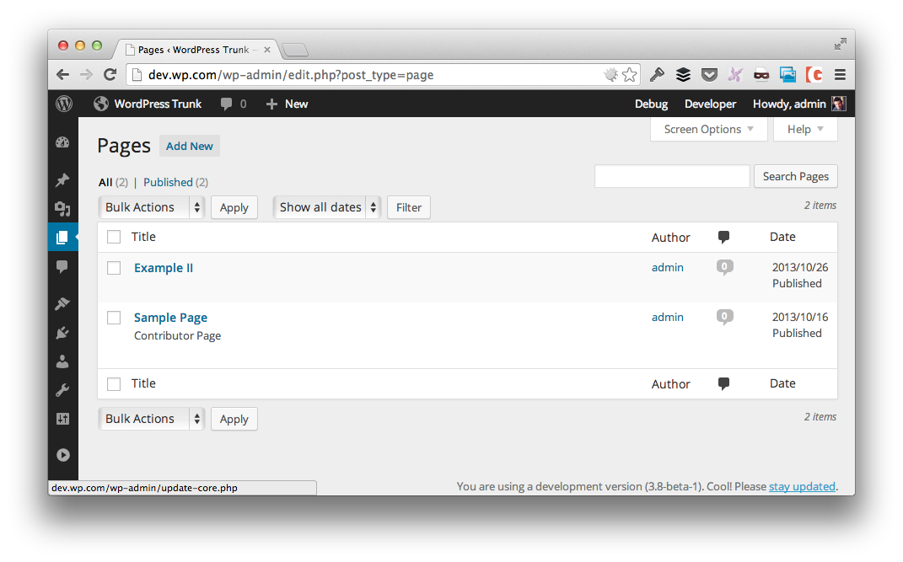

# Page Template Info

* Contributors: tommcfarlin
* Requires at least: 3.7.0
* Tested up to: 3.8-beta-1
* Stable tag: 0.1.0
* License: GPLv2 or later
* License URI: http://www.gnu.org/licenses/gpl-2.0.html

This plugin displays the name of the template associated with each page on the 'All Posts' page.

## Description

Rather than having to navigate to each individual page in the dashboard, this plugin will display
the name of the template assigned to a specific page in the 'All Pages' dashboard.

## Installation

### Using The WordPress Dashboard

1. Navigate to the 'Add New' Plugin Dashboard
2. Select `page-template-info` from your computer
3. Upload
4. Activate the plugin on the WordPress Plugin Dashboard

### Using FTP

1. Extract `page-template-info.zip` to your computer
2. Upload the `page-template-info` directory to your `wp-content/plugins` directory
3. Activate the plugin on the WordPress Plugins Dashboard

## Screenshots

## Changelog

### 0.1.0 (22 November 2013)

* Initial Release